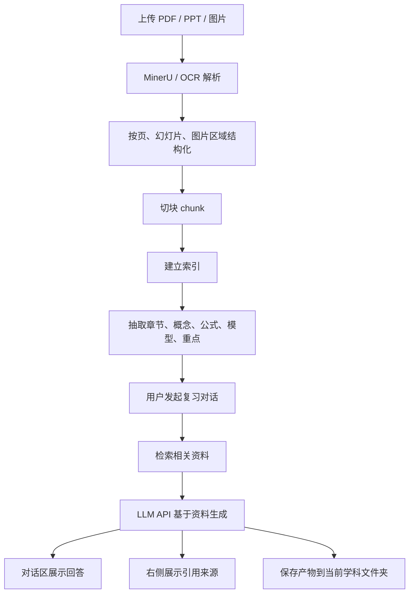

# Codex-like 期末速成 App 设计文档

## 目标

本项目仍然是期末速成引擎，不转型为通用知识库系统。桌面 App 的目标是让用户按学科管理资料，在一个类似 Codex 的三栏界面中与大模型对话复习，并把引用来源与生成产物实时展示、长期保存。

核心体验：

- 左侧是学科文件夹，每个文件夹对应一门课程或学科。
- 中间是用户与大模型的复习对话区。
- 右侧显示本次回答引用的资料来源，以及当前学科下已经生成的产物。
- 所有有效产物都必须保存到当前学科文件夹中，聊天窗口只是交互过程，不是最终存储位置。

## 产品边界

本项目不是通用 LLM Wiki、Obsidian 替代品或 AnythingLLM 克隆。RAG、索引、文档解析和可视化只服务于期末速成：

- 自动理解课程资料。
- 整合所有知识点。
- 生成速成路线、知识点树、思维导图、题库、错题本和考前总结。
- 在讲解、出题、补漏时尽量引用资料来源。

暂不做账号系统、云同步、团队协作、通用笔记库、复杂插件市场。

## 界面模型

```text
┌────────────────────┬──────────────────────────────┬──────────────────────┐
│ 左侧：学科文件夹     │ 中间：对话复习区               │ 右侧：引用与产出结果   │
│                    │                              │                      │
│ 通信原理            │ 用户：帮我速成通信原理          │ 引用资料              │
│   资料              │ AI：我先根据资料拆重点...       │ - 教材.pdf 第 45 页    │
│   速成计划          │                              │ - 第3讲.pptx 第 8 页   │
│   笔记              │ AI 讲解、追问、刷题、补漏        │                      │
│   思维导图          │                              │ 产出结果              │
│   题库              │ [输入框][上传][模型选择]        │ - 速成计划.md          │
│   错题本            │                              │ - 思维导图.html        │
│ 数字电路            │                              │ - 题库.md              │
└────────────────────┴──────────────────────────────┴──────────────────────┘
```

## 技术方案

采用 Tauri + React + assistant-ui 自建壳。

- 桌面壳：Tauri。
- 前端：React + TypeScript。
- 对话 UI：assistant-ui。
- 后端：Python FastAPI。
- 文档解析：MinerU 优先，PPT/PPTX 失败时用 LibreOffice 转 PDF 兜底。
- 图片/公式识别：先接 MinerU，后续可接 Pix2Text、pix2tex、PaddleOCR 等开源工具。
- 数据保存：SQLite + 文件系统。
- 检索：第一版做 chunk 管理和全文/关键词检索，后续接 LanceDB 或 Chroma 做向量检索。
- 大模型：App 内配置 OpenAI-compatible API，后续扩展 DeepSeek、通义、硅基流动等供应商。

## 学科文件夹与产物存储

每个学科都是独立工作区。所有资料、解析结果、对话和产物都保存在对应学科目录中。

推荐目录：

```text
%APPDATA%\cram-engine-mineru\subjects\通信原理\
  sources\
    第1讲.pptx
    教材.pdf
  parsed\
  chunks\
  index\
  chats\
    2026-06-15.jsonl
  artifacts\
    速成计划\
      期末速成路线.md
    笔记\
      第一章_信号与系统.md
    思维导图\
      通信原理总图.json
      通信原理总图.html
    题库\
      选择题.md
      简答题.md
    错题本\
      错题记录.md
    考前总结\
      三小时冲刺版.md
  citations\
    citations.json
  subject.sqlite
```

左侧文件夹树展示的是这个目录结构的结构化映射。用户点击产物时，App 在右侧或主区直接预览；文件仍然真实存在于学科目录中。

## Artifact 协议

大模型不直接决定写入路径，后端统一负责保存。模型生成可复用内容时，需要返回结构化产物声明：

```json
{
  "artifact_type": "mindmap",
  "subject": "通信原理",
  "title": "通信原理总图",
  "format": "json",
  "content": {},
  "citations": ["教材.pdf:p45", "第3讲.pptx:s8"]
}
```

后端根据 `artifact_type` 和当前学科，把内容保存到对应目录，并写入数据库索引。右侧产出结果列表来自数据库和文件系统同步结果，而不是仅来自聊天文本。

## AI 检索与生成流程



AI 不微调模型，也不把资料永久训练进模型。所谓“学习资料”是指把资料解析、切块、索引、抽取结构，并在每次回答时检索相关证据交给大模型。

## 准确率原则

生成必须遵守以下原则：

- 资料优先：重要结论、定义、公式、模型、重点判断尽量来自资料。
- 来源优先：回答和产物尽量附带来源文件、页码、幻灯片号或图片区域。
- 找不到就说明：资料中未找到明确依据时，必须标注为推理性解释。
- 整合优先：跨 PDF、PPT、图片合并同一知识点，不按文件机械摘要。
- 思维导图结构优先：优先表达章节、概念、公式、关系、易混点和高频考点。
- 场景解释条件触发：只有概念抽象、公式意义不明显、概念易混、资料中存在应用场景或题型需要时，才补充场景。
- 产物必须落盘：速成计划、笔记、思维导图、题库、错题本、考前总结都保存到当前学科文件夹。

## 第一版范围

第一版应完成：

- 新建、切换、删除学科文件夹。
- 学科内上传 PDF、PPT/PPTX、图片。
- 调用 MinerU 完成资料解析。
- 保存原始资料、解析结果和 chunk。
- 配置大模型 API。
- 在中间区域进行对话式复习。
- 基于资料检索生成回答。
- 右侧显示引用来源。
- 右侧显示并预览产物。
- 产物保存到对应学科文件夹。
- 支持速成计划、知识点树、思维导图、题库、错题本、考前总结这几类产物。

## 后续增强

- 向量检索：接 LanceDB 或 Chroma。
- 更强图片/公式识别：Pix2Text、pix2tex、PaddleOCR。
- 思维导图交互：节点点击后跳转对应资料来源或讲解。
- 原文查看器：在 App 内查看 PDF 页、PPT 幻灯片或图片区域。
- 多模型供应商。
- 一键导出 Markdown、HTML、PDF。

